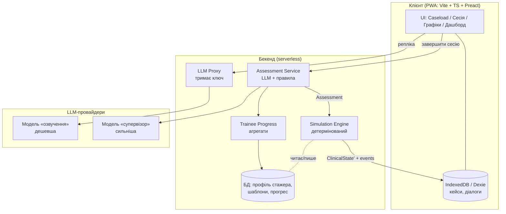
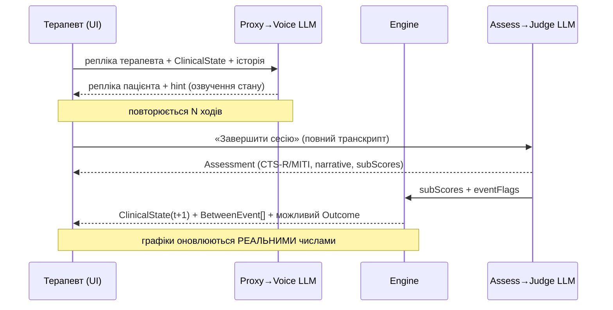

# ARCHITECTURE — КПТ-Клініка

> Сервіси, потоки даних, поділ відповідальності. Підпорядковано [SPEC.md](SPEC.md).

---

## 1. Принцип поділу
Три речі, які **не можна** змішувати:
1. **Озвучення** пацієнта (LLM, недетерміноване, «творче»).
2. **Рішення** про динаміку (Engine, детерміноване, клінічно валідне).
3. **Оцінювання** сесії (LLM + правила, «орієнтовне», переглядається людиною).

## 2. Компоненти

## 3. Потік однієї сесії

## 4. Відповідальності сервісів

| Сервіс | Робить | Не робить |
|---|---|---|
| **LLM Proxy** | тримає ключ, CORS, rate-limit, стрімінг | клінічних рішень |
| **Voice LLM** | відіграє пацієнта зі `ClinicalState` | не рахує шкали/динаміку |
| **Assessment** | CTS-R/MITI, детекція подій, narrative | не змінює стан напряму |
| **Engine** | детерміновано оновлює `ClinicalState`, зрив/dropout/safety | не звертається до LLM |
| **Progress** | агрегує компетентність стажера в часі | не оцінює окрему сесію |

## 5. Поділ моделей LLM
- **Озвучення** — швидша/дешевша модель (багато коротких реплік): напр. `gpt-4o-mini`
  / `claude-3-5-haiku`. Структурований вивід (JSON schema / tool use) для `{patient, hint}`.
- **Супервізія/оцінка** — сильніша модель (рідко, але точно): `gpt-4o` / `claude-3-5-sonnet`.
  Повертає **структуровані** бали CTS-R/MITI (а не вільний текст для парсингу).
- Промпти — зовнішні версіоновані файли, не літерали в коді.

## 6. Надійність LLM-інтеграції
- **Structured Outputs / tool use** замість «виріж `{...}` регуляркою».
- Окремі поля картки й вступної репліки (без розрізання по `\n\n`).
- Стрімінг реплік пацієнта; timeout / abort / retry; облік токенів.

## 7. Безпека й приватність
- Ключ — лише на бекенді (виправляє legacy-ризик прямих браузерних викликів).
- У UI — банер «навчальний інструмент, реальних пацієнтів не вводити».
- Детермінізм рушія + логування `seed` → відтворюваність для розбору/оцінювання.

## 8. Технологічний стек (цільовий)
| Шар | Вибір |
|---|---|
| Клієнт | Vite + TypeScript + Preact (або Lit) + Dexie |
| Графіки | легкий SVG-рендер (свій) або uPlot |
| PWA | Workbox (автопрекеш, prompt «оновитися») |
| Бекенд | serverless (Cloudflare Workers / Vercel) |
| БД | Postgres / D1 / KV (за хостингом) |
| Тести | Vitest (рушій і scoring — обов'язково) |

## 9. Міграція з legacy (v3.0.1)
Поточний vanilla-JS застосунок лишається робочим, поки шар за шаром переноситься.
Перший крок — винести клінічну логіку (шкали, інтерпретація) у чисті TS-модулі,
покрити тестами, і **замінити фейкові числа трекера на Engine** (Фаза 1–2 у ROADMAP).
